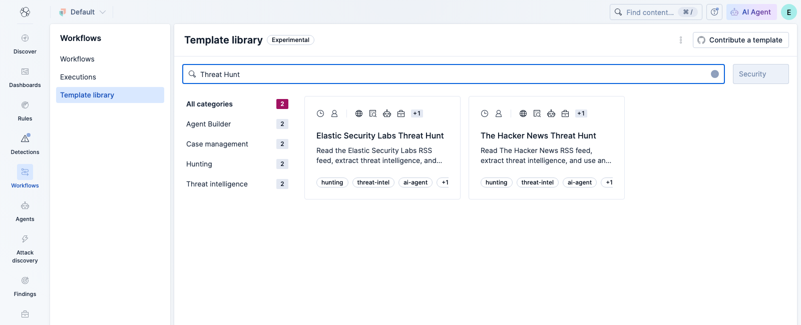
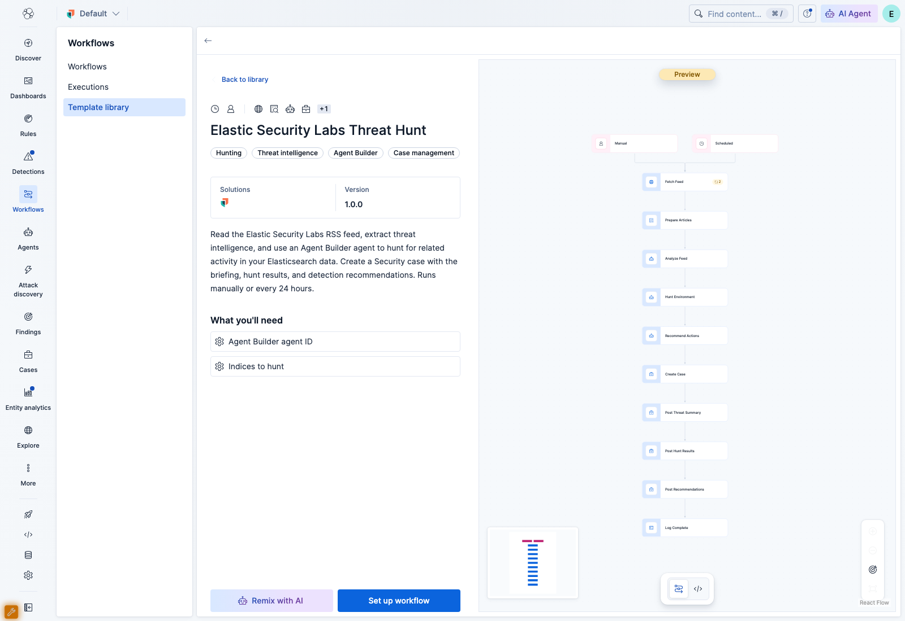
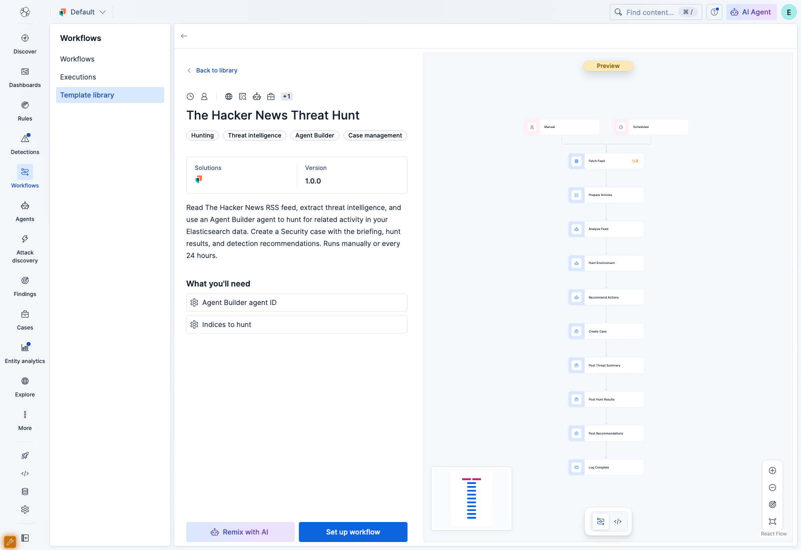
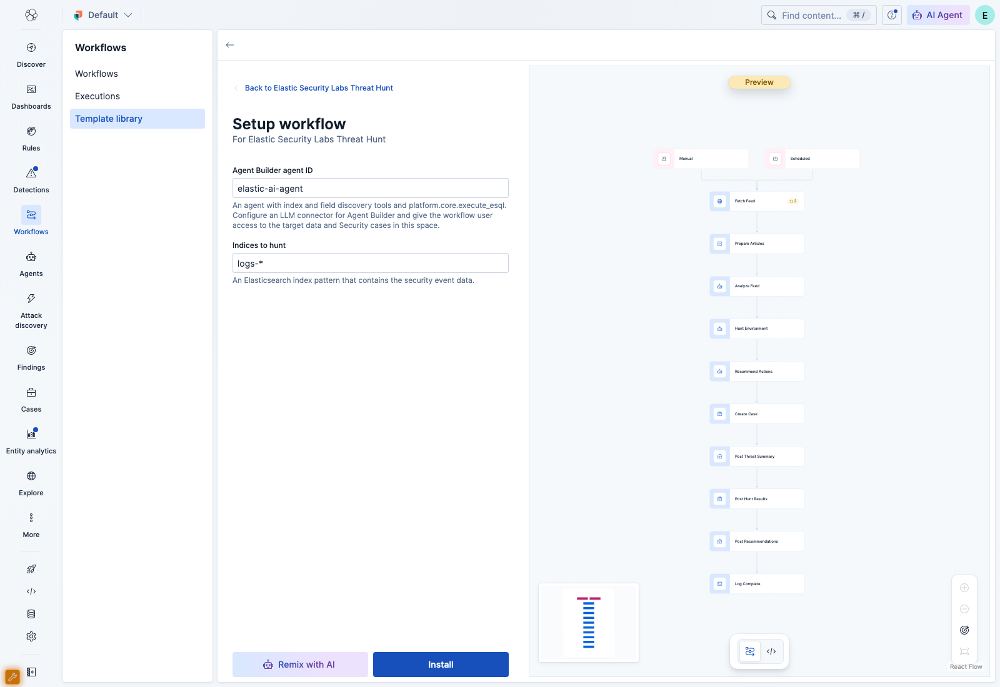

# Threat hunt template preview

[Download the library bundle](workflows-library-threat-hunts.tar.gz) and [SHA-256 checksum](workflows-library-threat-hunts.tar.gz.sha256).

Built from source commit `96ecad6`. The bundle includes the two new threat hunt templates and the existing library. Extract it and set `workflowsManagement.library.bundlePath` to the directory that contains `v1/`.

Kibana 9.6 loaded the bundle with `sourceMode: bundle`. The screenshots show the catalog, both workflow previews, and installation settings. No AI hunt was executed.

## Library

## Elastic Security Labs

## The Hacker News

## Installation settings

